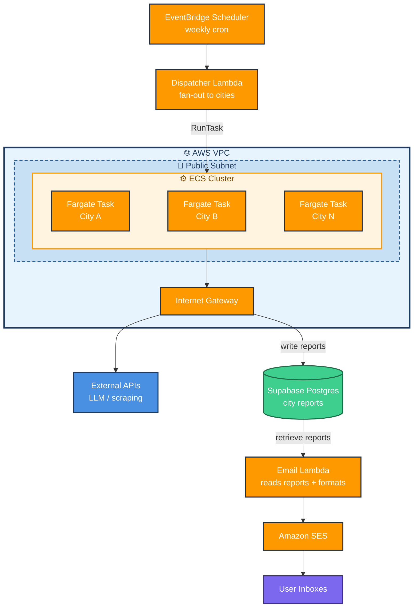

# AWS System Diagram

This is the high level design for the deployment of the Local agent. 

```mermaid
%% City Agent Pipeline - AWS Architecture
%% Import: draw.io -> Arrange -> Insert -> Advanced -> Mermaid
%% Or paste at https://mermaid.live then export SVG/PNG for Google Drawings
flowchart TD
    EB[EventBridge Scheduler<br/>weekly cron]
    DL[Dispatcher Lambda<br/>fan-out to cities]
    subgraph VPC["🌐 AWS VPC"]
        IGW[Internet Gateway]
        subgraph PUB["📡 Public Subnet"]
            subgraph ECS["⚙️ ECS Cluster"]
                direction LR
                F1[Fargate Task<br/>City A]
                F2[Fargate Task<br/>City B]
                F3[Fargate Task<br/>City N]
                F1 ~~~ F2
                F2 ~~~ F3
            end
        end
    end
    EXT[External APIs<br/>LLM / scraping]
    DB[(Supabase Postgres<br/>city reports)]
    EML[Email Lambda<br/>reads reports + formats]
    SES[Amazon SES]
    USERS[User Inboxes]
    EB --> DL
    DL -- RunTask --> ECS
    ECS --> IGW
    IGW --> EXT
    IGW -- write reports --> DB
    DB -- retrieve reports --> EML
    EML --> SES
    SES --> USERS
    classDef aws fill:#FF9900,stroke:#232F3E,stroke-width:2px,color:#fff
    classDef ext fill:#4A90E2,stroke:#1F3A5F,stroke-width:2px,color:#fff
    classDef db fill:#3ECF8E,stroke:#1F6B47,stroke-width:2px,color:#fff
    classDef user fill:#7B68EE,stroke:#3F2E8C,stroke-width:2px,color:#fff
    class EB,DL,F1,F2,F3,IGW,EML,SES aws
    class EXT ext
    class DB db
    class USERS user
    style VPC fill:#E8F4FD,stroke:#1F3A5F,stroke-width:3px,color:#1F3A5F
    style PUB fill:#C8E0F4,stroke:#2C5F8D,stroke-width:2px,stroke-dasharray: 6 4,color:#1F3A5F
    style ECS fill:#FFF4E0,stroke:#FF9900,stroke-width:2px,color:#7A4A00
```
