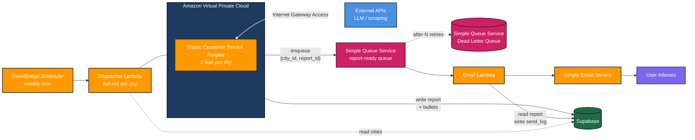

# AWS System Design

High-level architecture for the City Agent email pipeline. Reports are generated weekly per city, queued via Simple Queue Service, and emailed to subscribers via Simple Email Service.

## Flow Summary

1. **EventBridge** triggers the **Dispatcher Lambda** on a weekly cron.
2. **Dispatcher Lambda** reads the active cities from **Supabase** and fans out one **Elastic Container Service Fargate** task per city.
3. Each **Fargate task** calls external APIs (LLM, scraping) to generate report content, writes the report and its bullets to **Supabase**, then enqueues a message to **Simple Queue Service** containing `{city_id, report_id}` and exits.
4. **Simple Queue Service** holds the message. AWS-managed pollers invoke the **Email Lambda** with batches of messages. Lambda reserved concurrency caps parallel executions to protect Simple Email Service rate limits.
5. **Email Lambda** reads the report and bullets from Supabase, queries subscribers for the city, renders the email, sends via **Simple Email Service**, and writes to `send_log` for idempotency.
6. Failed messages are retried automatically by Simple Queue Service. After N failures, they land in the **Dead Letter Queue** for investigation.
