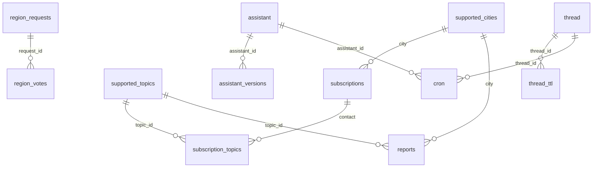

# Database Infrastructure

The Supabase database is organized into four functional groups: pipeline tables (core to the NV Local research pipeline), platform tables (admin, chat, and region voting), LangGraph persistence tables (managed by the LangGraph framework), and migration tracking. All tables have RLS enabled.

---

## Pipeline Tables

These tables power the NV Local research pipeline — city/topic configuration, subscriber management, and report storage.

### supported_cities

| Column | Type | Notes |
| --- | --- | --- |
| `city` | `text` | Primary key; canonical city label. |

Lookup table constraining subscriptions and reports to the vetted list of launch markets.

### supported_topics

| Column | Type | Notes |
| --- | --- | --- |
| `topic_id` | `integer` | Identity primary key (BY DEFAULT). |
| `topic_name` | `text` | Unique canonical label (e.g., `immigration`, `civil rights`, `economy`). |
| `description` | `text` | Short explanation of what the topic covers. |

New topics must be inserted here first so that `subscription_topics` and `reports` can reference their IDs.

### subscriptions

| Column | Type | Notes |
| --- | --- | --- |
| `contact` | `text` | Primary key; subscriber email or handle. |
| `city` | `text` | Nullable; foreign key → `supported_cities.city`. |
| `stripe_customer_id` | `text` | Nullable; Stripe customer identifier. |
| `stripe_subscription_id` | `text` | Nullable; Stripe subscription identifier. |
| `stripe_status` | `text` | Nullable; current Stripe subscription status. |
| `stripe_period_end` | `timestamptz` | Nullable; end of the current billing period. |
| `referral_code` | `text` | Nullable, unique; subscriber's referral code. |
| `tier` | `text` | Nullable; subscription tier. CHECK: `'pro'` or `'free'`. |

Each subscription holds a unique contact identifier and optionally references a city. Stripe billing fields track subscription state. Topics are managed through the `subscription_topics` junction table.

### subscription_topics (Junction Table)

| Column | Type | Notes |
| --- | --- | --- |
| `subscription_id` | `text` | Foreign key → `subscriptions.contact`. |
| `topic_id` | `integer` | Foreign key → `supported_topics.topic_id`. |

Composite primary key `(subscription_id, topic_id)`. Implements the many-to-many relationship between subscriptions and topics.

### reports

| Column | Type | Notes |
| --- | --- | --- |
| `id` | `bigint` | Identity primary key (ALWAYS GENERATED). |
| `city` | `text` | Foreign key → `supported_cities.city`. |
| `topic_id` | `integer` | Foreign key → `supported_topics.topic_id`. |
| `report_date` | `date` | Date the report covers; defaults to `CURRENT_DATE`. |
| `items` | `jsonb` | Array of legislation items, each `{"header": "...", "description": "..."}`. Defaults to `'[]'::jsonb`. |

Each row stores one pipeline run's output for a city+topic+date. A unique constraint on `(city, topic_id, report_date)` enforces one report per combination per day; re-runs upsert over the existing row.

---

## Platform Tables

These tables support the Next Voters web platform — admin management, chat tracking, and community-driven city expansion requests.

### admin_table

| Column | Type | Notes |
| --- | --- | --- |
| `email` | `text` | Primary key; admin email address. |
| `name` | `text` | Admin display name. |

### user_admin_requests

| Column | Type | Notes |
| --- | --- | --- |
| `email` | `text` | Primary key; requester email address. |
| `name` | `text` | Requester display name. |

Holds pending requests for admin access. Approved entries are promoted to `admin_table`.

### chat_count

| Column | Type | Notes |
| --- | --- | --- |
| `id` | `bigint` | Identity primary key (BY DEFAULT). |
| `responses` | `bigint` | Number of chat responses served. |
| `requests` | `bigint` | Nullable; number of chat requests received. |

Tracks aggregate chat usage metrics.

### region_requests

| Column | Type | Notes |
| --- | --- | --- |
| `id` | `integer` | Serial primary key. |
| `city` | `text` | Unique; the requested city name. |
| `vote_count` | `integer` | Current vote tally; defaults to `0`. |
| `threshold` | `integer` | Votes required for approval; defaults to `25`. |
| `status` | `text` | CHECK: `'pending'`, `'approved'`, or `'rejected'`; defaults to `'pending'`. |
| `created_at` | `timestamptz` | Row creation timestamp; defaults to `now()`. |

Community-driven city expansion: users vote for cities they want covered. When `vote_count` reaches `threshold`, the request can be approved and the city added to `supported_cities`.

### region_votes

| Column | Type | Notes |
| --- | --- | --- |
| `id` | `integer` | Serial primary key. |
| `request_id` | `integer` | Foreign key → `region_requests.id`. |
| `voter_email` | `text` | Email of the voter. |
| `referral_code` | `text` | Nullable; referral code used when voting. |
| `created_at` | `timestamptz` | Vote timestamp; defaults to `now()`. |

Individual votes cast for a region request.

---

## LangGraph Persistence Tables

These tables are managed by the LangGraph framework and store agent execution state. They are not directly queried by application code.

| Table | Primary Key | Purpose |
| --- | --- | --- |
| `assistant` | `assistant_id` (uuid) | Registered assistant definitions (graph_id, config, metadata, version). |
| `assistant_versions` | `(assistant_id, version)` | Version history for assistant configurations. FK → `assistant`. |
| `thread` | `thread_id` (uuid) | Conversation threads with status, config, values, and interrupts. |
| `thread_ttl` | `id` (uuid) | TTL policies for threads (strategy, ttl_minutes, computed expires_at). FK → `thread`. |
| `run` | `run_id` (uuid) | Individual execution runs tied to a thread and assistant. |
| `checkpoints` | `(thread_id, checkpoint_id, checkpoint_ns)` | Graph state snapshots at each step. |
| `checkpoint_blobs` | `(thread_id, channel, version, checkpoint_ns)` | Binary blobs for checkpoint channel data. |
| `checkpoint_writes` | `(thread_id, checkpoint_id, task_id, idx, checkpoint_ns)` | Pending writes for checkpoint channels. |
| `cron` | `cron_id` (uuid) | Scheduled recurring runs (schedule, payload, enabled flag). FK → `assistant`, `thread`. |
| `store` | `(prefix, key)` | Key-value store with optional TTL for cross-thread persistence. |

---

## Schema Migrations

| Column | Type | Notes |
| --- | --- | --- |
| `version` | `bigint` | Primary key; migration version number. |
| `dirty` | `boolean` | Whether this migration is in a dirty (incomplete) state. |

Standard migration tracking table used by the migration framework.

---

## Entity Relationships

Key relationships:
- `supported_cities` supplies city references for `subscriptions` and `reports` (one-to-many).
- `supported_topics` is referenced by `subscription_topics` (subscriber preferences) and `reports` (pipeline output).
- `subscriptions` ↔ `supported_topics` linked through `subscription_topics` (many-to-many).
- `region_requests` ↔ `region_votes` (one-to-many; each request collects votes).
- LangGraph tables: `assistant` → `assistant_versions` and `cron`; `thread` → `thread_ttl` and `cron`.

---

## Code Integration

Pipeline tables are queried via two modules:

**`utils/supabase_client.py`**:
- `get_supabase_client()` → `Client` — creates a Supabase client from `SUPABASE_URL` and `SUPABASE_KEY` env vars
- `get_supported_cities_from_db()` → `list[str]` — queries `supported_cities` ordered alphabetically
- `get_supported_topics()` → `list[str]` — queries `supported_topics.topic_name` ordered alphabetically

**`utils/report/storage.py`**:
- `_get_topic_id(topic_name)` → `int | None` — resolves a topic name to its integer ID via `supported_topics` (cached)
- `save_report(city, topic_name, result)` → `bool` — extracts structured items from a pipeline result dict and upserts to the `reports` table on conflict `(city, topic_id, report_date)`

---

## Operational Guidance

- **Seed lookup tables first**: ensure all topics and cities exist in their respective lookup tables before creating subscriptions or junction table entries.
- **Insert topics before linking**: when adding a new topic, insert it into `supported_topics`, then create rows in `subscription_topics` to link it to existing subscriptions.
- **Query patterns**: to fetch all topics for a subscription, join `subscriptions` → `subscription_topics` → `supported_topics`. To find all subscribers of a topic, reverse the join direction.
- **Maintain referential integrity**: never insert into `subscription_topics` without first ensuring both the subscription and topic exist in their parent tables; the database will reject violations.
- **Region request workflow**: new city requests go into `region_requests` with status `pending`. Votes are recorded in `region_votes`. When `vote_count` meets `threshold`, approve the request and add the city to `supported_cities`.
